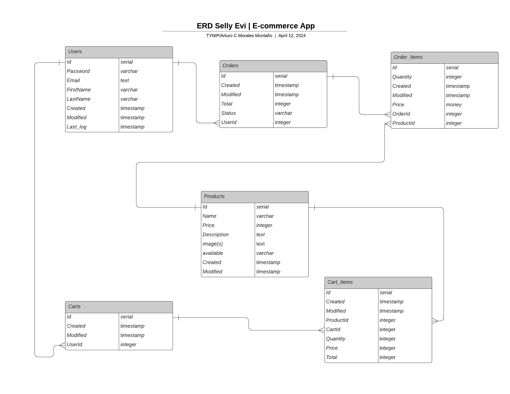

# SERVER - SellyEvi | E-commerce APP
Backend of Selly Evi e-commerce application.

[CLIENT - SellyEvi](../sellyEvi_CLIENT/README.md)
[API DOCUMENTATION](../sellyEvi_CLIENT/README.md)

## API Structure

The API follows a modular structure, with each component responsible for a specific aspect of the application:

- **index.js**: Entry point of the application, starts the server.
- **loader folder**: Manages middleware, authentication using Passport, and sets up Swagger documentation.
- **routes folder**: Defines all API endpoints and connects them to corresponding service functions.
- **services folder**: Handles business logic and calls functions from the model folder.
- **models folder**: Interacts with the PostgreSQL database and performs CRUD operations.

## Data Base ERD

## Security Measures
### Authentication and Authorization
- The API uses Passport.js for authentication, supporting both local and Google OAuth2 strategies.
- Passwords are securely hashed using Bcrypt before being stored in the database.
- Sessions are managed securely using the express-session middleware with session cookies.
- Access control is implemented to restrict access to certain endpoints based on user roles or permissions.

### Data Protection
- CORS (Cross-Origin Resource Sharing) is configured to allow requests only from trusted domains, preventing unauthorized access to resources.
- Helmet is used to set various HTTP headers to secure the API against common vulnerabilities, such as XSS (Cross-Site Scripting) attacks.
- Data stored in the database is protected against SQL injections by using parameterized queries provided by Sequelize ORM.
- Sensitive data exposure is minimized by securely hashing passwords and encrypting session cookies.
- Authentication tokens are securely transmitted using HTTPS to prevent interception and tampering.

### OWASP Top 10 Protection
The API is protected against various types of attacks outlined in the OWASP Top 10:

1) Injection Attacks: Parameterized queries are used to prevent SQL injection attacks.
2) Broken Authentication: Passwords are securely hashed, and authentication tokens are encrypted to prevent unauthorized access.
3) Sensitive Data Exposure: Sensitive data such as passwords and session cookies are encrypted and securely stored.
4) XML External Entities (XXE): The API does not process XML input, reducing the risk of XXE attacks.
5) Broken Access Control: Access control measures are implemented to restrict access to authorized users only.
6) Security Misconfiguration: The API is configured with secure defaults using middleware such as Helmet.
7) Cross-Site Scripting (XSS): Helmet sets HTTP headers to prevent XSS attacks, and user input is sanitized before being processed.
8) Insecure Deserialization: Serialized data is validated and sanitized to prevent insecure deserialization vulnerabilities.
9) Using Components with Known Vulnerabilities: Regular updates and patches are applied to all dependencies to mitigate known vulnerabilities.
10) Insufficient Logging & Monitoring: Comprehensive logging and monitoring are implemented to detect and respond to security incidents.

## API Features
- User authentication and authorization
- Product management (CRUD operations)
- Cart management (Add, remove, update cart items)
- Order management (Create, list orders)
- Search products
- Google OAuth2 authentication
- Secure session management
- CORS protection
- HTTPS support
- Error handling middleware

## Technologies Used
- Node.js
- Express.js
- PostgreSQL
- Sequelize ORM
- Passport.js (for authentication)
- Bcrypt (for password hashing)
- Stripe (for payment processing)
- Swagger (for API documentation)
- js-yaml (for YAML file generation)
- luxon.js (for date/time manipulation)
- cors: Middleware for enabling CORS (Cross-Origin Resource Sharing).
- dotenv: Loads environment variables from a .env file.
- Helmet
- body-parser
- Compression
- fs
- pg
- pg-promise
- express-session: Middleware for managing session data.
- http-errors: Creates HTTP error objects.
- passport-local: Passport strategy for authenticating with a username and password.
- passport-google-oauth20
